# **Git - Versioning and Collaboration**

Software Engineering - Tutorial

#### Dr. Antonio Bucchiarone - bucchiarone@fbk.eu

*Academic year 2022/2023*

---

# Tutorial Lectures of this course [*]


- Git - Versioning and collaboration with Git and Github
- Database: MongoDB - Mongoose
- Backend: JavaScript- WebAPI - NodeJS - Express - apiary.io (WebAPIs documentation)
- FrontEnd - Vue.js
- Agile and DevOps: Kanban
- Testing - Jest
- CI/CD - Heroku

[*]: Thanks to Marco Robol @Unitn for some of the material used during these tutorials.

---

# Contents of today class

- Git basics
- Versioning
- Branching
- Collaboration
- Advanced

### Tools and references

- CLI (https://git-scm.com/downloads)
- GitHub (https://github.com)
- Git Tutorial (https://www.atlassian.com/git/tutorials)


---

# What is version control?

Version control systems (VCSs) are a category of software tools that help a software team manage changes to source code over time:

- keeps track of every modification to the code
- developers can turn back the clock and compare earlier versions
- each developer may make their changes in several parts of the file tree

Version control helps teams solve these kinds of problems, tracking every individual change by each contributor and helping prevent concurrent work from conflicting.

---

# Versioning

If you're a developer who has never used version control you may have added versions to your files, perhaps with suffixes like "final" or "latest" and then had to later deal
with a new final version. Perhaps you've commented out code blocks because you want to disable certain functionality without deleting the code.

- How much do you save?
- How do you name these versions?
- How do you know what exactly is different in these versions?

---

# Collaboration

Without a VCS in place, you're probably working together in a shared folder on the same set of files. Shouting through the office that you are currently working on file "xyz" and that, meanwhile, your teammates should keep their fingers off is not an acceptable workflow

---

# Restoring Previous Versions

- If the changes you've made lately prove to be garbage, you can simply undo them in a few clicks
- this should make you a lot more relaxed when working on
important bits of a project

# Understanding What Happened

- short description of what was changed
- Additionally (if it's a code / text file), you can see what exactly was changed in the file's content

---

# Git Basics

---

### Initialize a new repository `git init`

> https://www.atlassian.com/git/tutorials/setting-up-a-repository/git-init

```shell
create a folder: ​mkdir gitlesson
cd to that folder: ​cd gitlesson
create a file (for example, ​pico app.js​ and enter ​const port = 3000​; and save )
ls -la​: notice that the folder is clean, it only has that file

git init​: system answers with Initialized empty Git repository in….
ls -la​: notice the new .git file
git status​: sys responds with (don’t worry for now if you don’t understand this text below)
    On branch master
    No commits yet
    Untracked files: (use "git add <file>..." to include in what will be committed)
        app.js
    nothing added to commit but untracked files present (use "git add" to track)
```

---

Before you proceed, there are a couple of things you probably want to do: Tell Git who you are and set your default text editor.

`git config --global user.name "<your name>"`

`git config --global user.email <your email>`

`git config credential.username <your username>`

`git config --global core.editor pico`

---

### Check status

`git status`

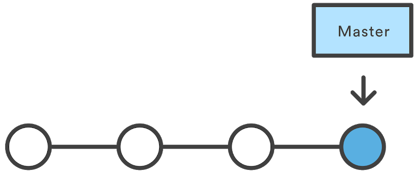

---

### Stage files (tracked and untracked)

`git add .` - add tracked files to staging area

`git reset HEAD` - remove files from staging area - more details on this later

### Commit staged changes

`git commit -m "first commit"`

(-m: add message)  
(-a: stage changed tracked files, but in case you have new files you need to do `git add .` to manually track them )    
(In Vim press `Esc` and then type `:q` to quit; `:w` to save; `:x` to save and exit)

### Include staged changes in last commit

`git commit -amend`

---

```
We will now add ​app.js​ to the repository staging area and then create
a new commit with a message describing what work was done in the commit.
Do:
- Change directory to our ​gitlesson​ folder if you are not there already
- git add app.js​: system does not say anything
- git status​: app.js is now among the changes to be committed, as a new file
- git commit -m "add port constant"​: system responds with (your output may
differ slightly)
    [master (root-commit) 7bba746] add port constant
    1 file changed, 1 insertion(+)
    create mode 100644 app.js
```
After executing this example, your repo will now app.js added to the history ​and will track future updates to the file.

---

### Check commits history

`git log --oneline`

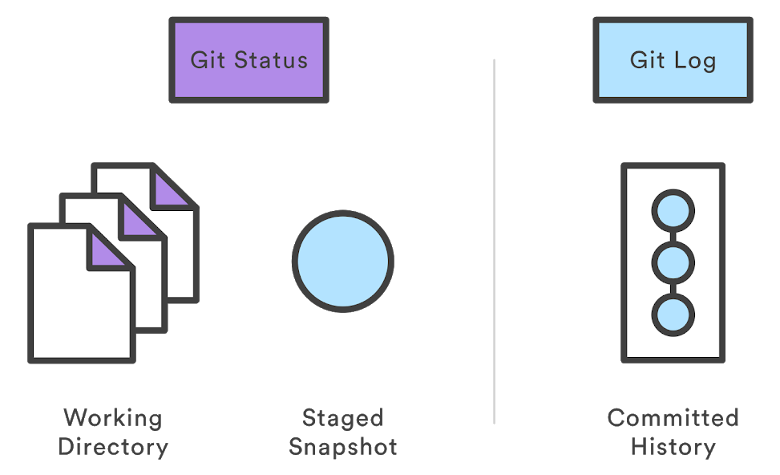

---

Now, let’s make a change and commit again.

```
Add a line to app.js​, for example insert const http = require('http');
- git status​: (always good to do git status, never hurts). see our changes
are NOT staged for commit. If you commit now, nothing will be committed.
- git add app.js
- git status​: now change is to be committed
- git commit -m "add http library"​: system adds to commit
- git status
- git log --oneline
    8bca9ed (​HEAD -> master​) add http library
    7bba746 add port constant
```

​What is this HEAD and master thing?

---

### Check differences

`git diff master^^ index.js` (check with 3 REPO commits ago)

`git diff <hash> index.js `

### Revert back your working directory to a previous commit

`git checkout <commit ID>`

`git checkout master`

---

## *master* branch and *HEAD* pointer

In git, a ​**branch**​ is a *pointer to a commit*, and it has a readable name. When you start a git repo, git creates a *default branch called ​master*. ​Git also has a **pointer called HEAD**, which *points to the current version of commit*. Initially HEAD points to master.

When you commit, git not only creates a new commit but advances the branch pointer to point to the new commit. So, after a commit on the master branch, git advances the master pointer to the new commit, while HEAD keeps pointing to master.

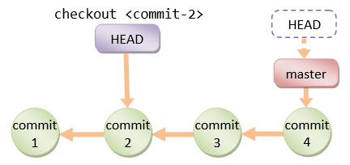

---

## Navigating the commit history

You can use ​git **checkout​** to revert back your working directory to a previous commit. Internally, the git checkout command simply updates the HEAD (a pointer to the current version of commit) of your git repository to point to either the specified ​branch​ or commit.

When HEAD points to a branch, Git doesn't complain, but *when you check out a commit, it switches into a “detached HEAD”* state.

---

#### Try

```
● git log --oneline​: ​what is this HEAD and master thing? discuss
● git checkout {previous commit ID}
● more app.js​: see we reverted the file to the previous state
● ls-la​: the entire folder is reverted (!)
● git checkout master​: revert back to latests state, identified
in this case by the label master
```

---

# Branching and merging

---

# Branching

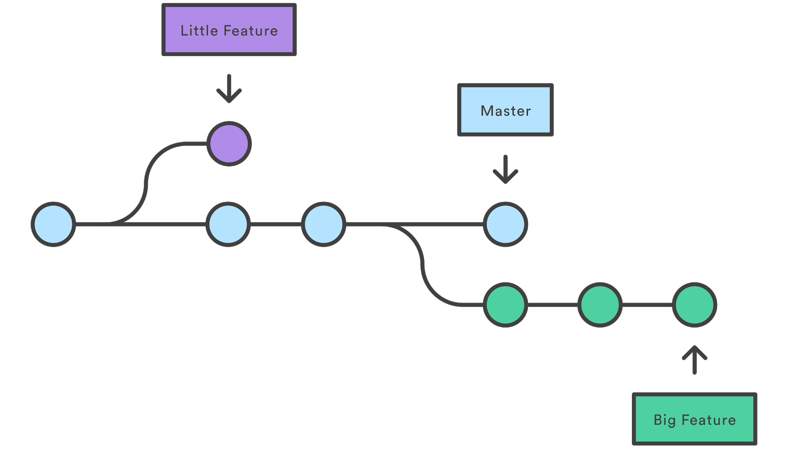

---

### Create a branch

Modify files then create a new branch, stage and commit changes.

`git branch newFunction`
`git checkout newFunction`

Alternatively:

`git checkout -b newFunction`
`git commit -am "commit in the new branch"`
`git log`

### Delete a branch

`git branch -d newFunction`

---

## Fast-forward merge

`git checkout master`

`git merge newFunction`

`git log --graph --decorate --oneline`

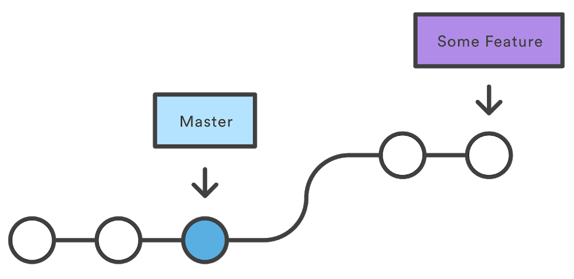

---

## Three-way merge

A fast-forward merge is not possible if the branches have diverged.

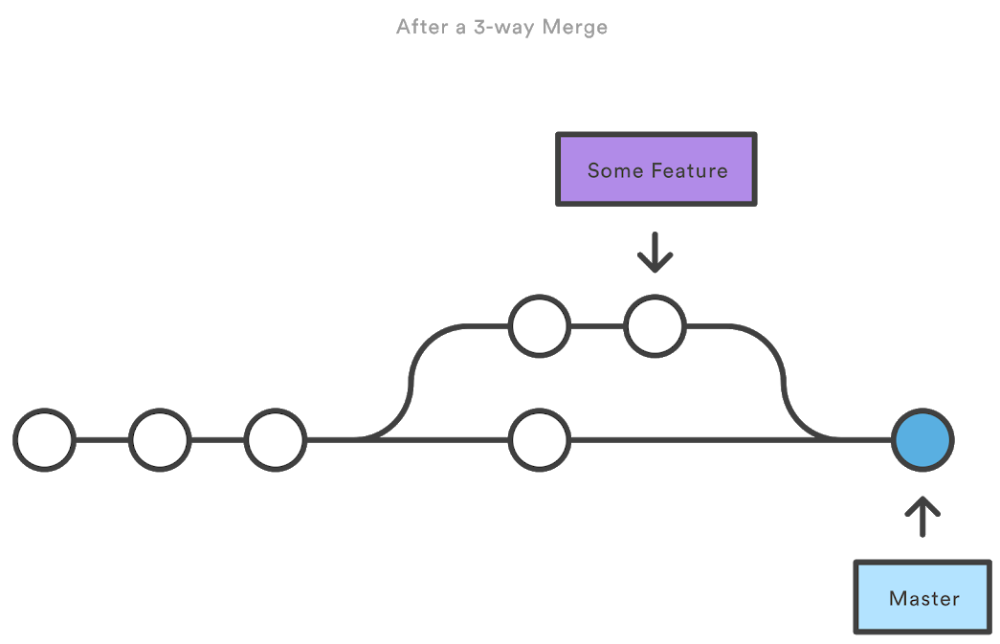

---

## Conflicts in 3-way merge `git mergetool`

```javascript
...
<<<<<<< HEAD
  "name": "branch-master",
=======
  "name": "new-feature",
>>>>>>> newFeature
  "version": "1.0.0",
...
```

#### P4Merge visual tool `git config merge.tool p4merge`

https://www.perforce.com/products/helix-core-apps/merge-diff-tool-p4merge

#### Visual studio Code to resolve conflicts - `conflicts highlighted`

---

### Try

- create a branch `git branch newport`
- modify readme on branch
`git add .` `git commit -m "add readme"`
`git log --graph --decorate --oneline ​(notice HEAD and master and branch)`
- move on newport `git checkout newport`
- modify app.js
`git add .` `git commit -m "change port to 3001"`
- move on master `git checkout master`
- merge `git merge newport ​- editor will open for commit message. just save.`

How can we create a merge conflict?

---

# Collaboration

https://www.atlassian.com/git/tutorials/syncing

---

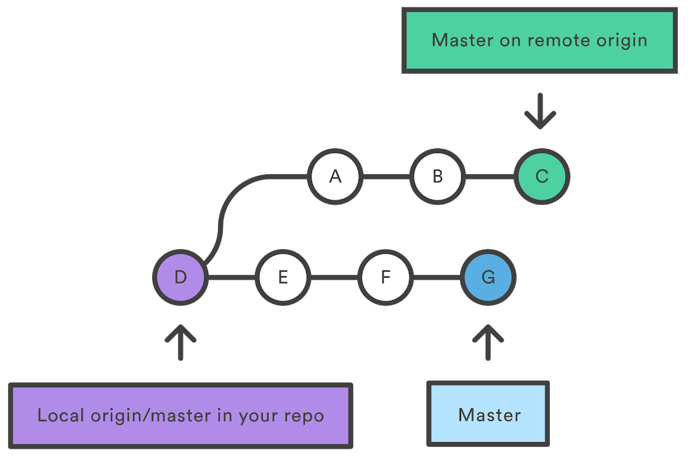

---

### Clone

1. On github.com create a github repository

1. Clone repository in a local directory

    `git clone [repoAddress] [folderName]`

1. Check differences with remote repository
    
    `git diff origin master index.js `

---

### Pull changes

`git pull`

### Fetching changes without merging

`git fetch origin master`

`git branch -a`

### Push changes to remote repository

`git push origin master`

---

Before and after a pull with a three-way merge:

 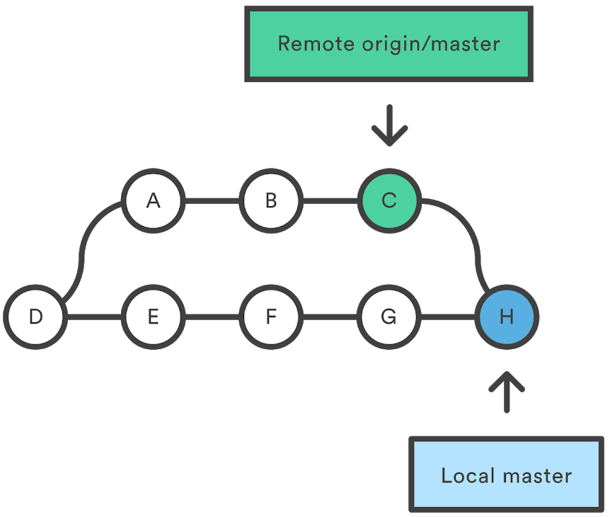

---

### Git remote

`git remote -v`

`git remote add <name> <url>`

### Delete remote branch

`git branch -d [branch_name]` (delete only local branch)

`git push origin -d [branch_name]`

`git push origin :[branch_name]`

---

# Advanced

    stash, rebase, tag, reset, revert ...

---

### Stashing changes before applying `git stash` `git stash pop`
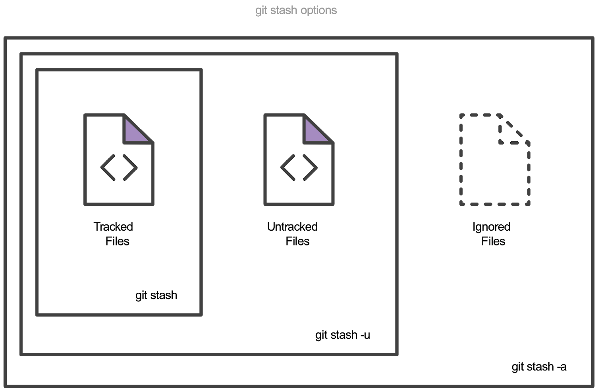

---

# Rebasing

`git rebase master` (commits in current branch are "re-applied" to the head of master)

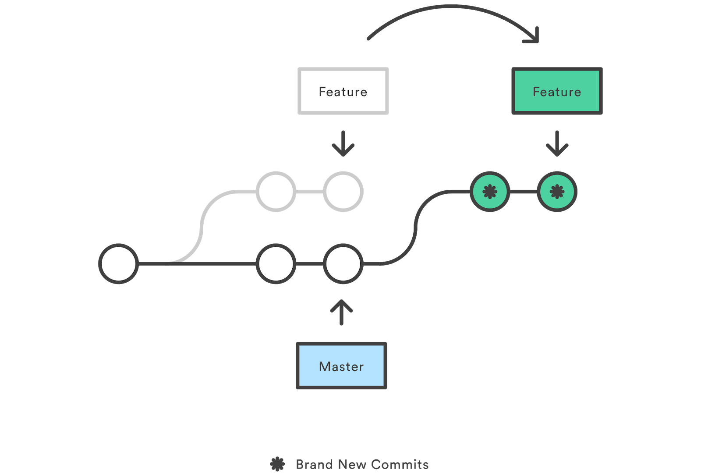

---

### Git Rebase Interactive

`git rebase -i master`

Commands:
p, pick = use commit
r, reword = use commit, but edit the commit message
e, edit = use commit, but stop for amending
s, squash = use commit, but meld into previous commit
f, fixup = like "squash", but discard this commit's log message
x, exec = run command (the rest of the line) using shell
d, drop = remove commit

---

### Try it yourself

- checkout master in an existing repo
- create a branch (say, somefeature)
- make a change and commit (on master)
- checkout somefeature
- make a change on somefeature (conflicting with master) and commit
- make another change on somefeature and commit
- make a third change on somefeature and commit
- then rebase, squashing the commit into one
- `git log --graph --decorate --oneline`

---

### Tagging

​Lightweight​ tag `git tag v1.0`

Annotated tag `git tag -a v1.4` store extra meta data such as: the tagger name, email, and date. A best practice is to consider Annotated tags as public, and Lightweight tags as private​. 

The -m option and a message `git tag -a v1.0 -m "my version 1.0"` will immediately create a new tag and forgot opening the local text editor.

To list stored tags in a repo: `git tag`

---

# Undoing Commits & Changes

---

### Reset - `git reset HEAD~2 <file>...`

- --soft – The staged snapshot and working directory are not altered in any way.
- --mixed – The staged snapshot is updated to match the specified commit, but the working directory is not affected. This is the default option.
- --hard – The staged snapshot and the working directory are both updated to match the specified commit.

For example, the following command moves the hotfix branch backwards by two commits. `git checkout hotfix` `git reset HEAD~2`

---

### Revert - `git revert`

The git revert command can be considered an 'undo' type command, however, it is not a traditional undo operation. Instead of removing the commit from the project history, **it figures out how to invert the changes introduced by the commit and appends a new commit with the resulting inverse content**. This prevents Git from losing history, which is important for the integrity of your revision history and for reliable collaboration.

---

### Revert vs. reset

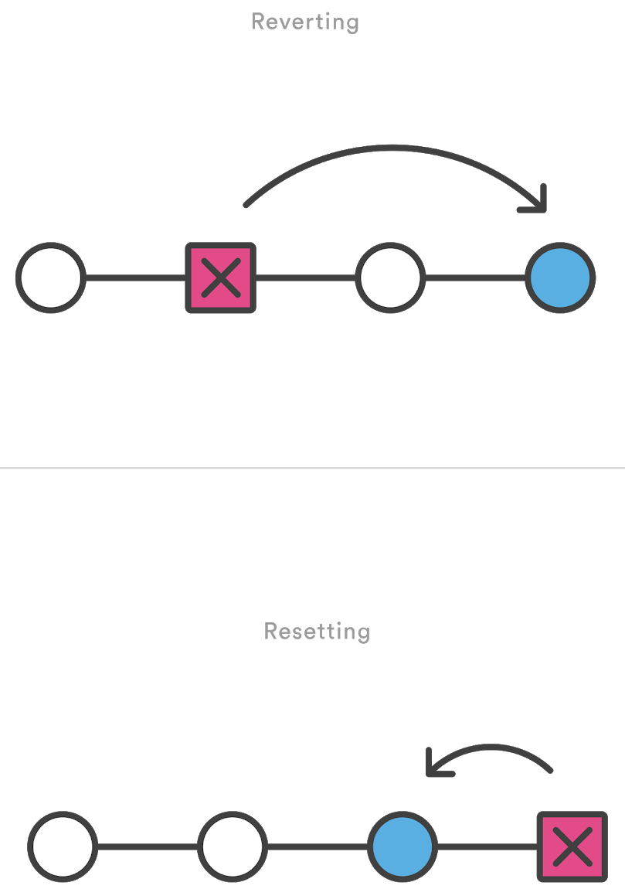

---

#### Try revert:

```
git init .
git add demo_file
git commit -am"initial commit"
echo "initial content" >> demo_file
git commit -am"add new content to demo file"
echo "prepended line content" >> demo_file
git commit -am"prepend content to demo file"
git log --oneline
    86bb32e prepend content to demo file
    3602d88 add new content to demo file
    299b15f initial commit
git revert HEAD
    [master b9cd081] Revert "prepend content to demo file"
    1 file changed, 1 deletion(-)
git log --oneline
    1061e79 Revert "prepend content to demo file"
    86bb32e prepend content to demo file
    3602d88 add new content to demo file
    299b15f initial commit
```

---

### Use the integrated UI

`gitk`

### Git cheat sheet

> https://www.atlassian.com/git/tutorials/atlassian-git-cheatsheet


---

# Git Workflows
> https://about.gitlab.com/topics/version-control/what-is-git-workflow/


---


### Centralized Workflow

In this flow, the default development branch is called master and all changes are committed into this branch​. ​This workflow doesn’t require any other branches besides master​.

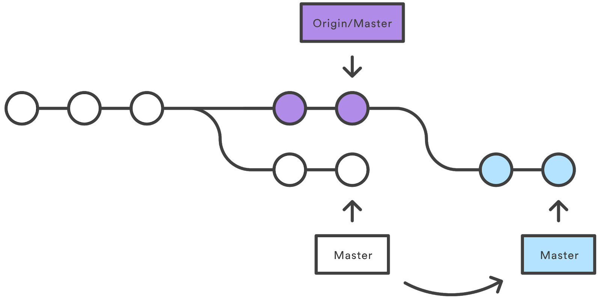

---

Tip:

`git pull --rebase origin master`

The pull would still work if you forgot this option, but you would wind up with a superfluous “merge commit” every time someone needed to synchronize with the central repository. For this workflow, it’s always better to rebase instead of generating a merge commit.

---

### Git Feature Branch Workflow

The core idea behind the Feature Branch Workflow is that all feature development should take place in a dedicated branch instead of the master branch.​ ​This encapsulation makes it easy for multiple developers to work on a particular feature without disturbing the main codebase. It also means the master branch will never contain broken code, which is a huge advantage for continuous integration environments.


---

### Gitflow Workflow

https://www.atlassian.com/git/tutorials/comparing-workflows

The Gitflow Workflow defines a strict branching model designed around the project release. This provides a robust framework for managing larger projects.

This workflow doesn’t add any new concepts or commands beyond what’s required for the ​Feature Branch Workflow​. Instead, it assigns very specific roles to different branches and defines how and when they should interact. In addition to feature branches, it uses individual branches for preparing, maintaining, and recording releases.

---

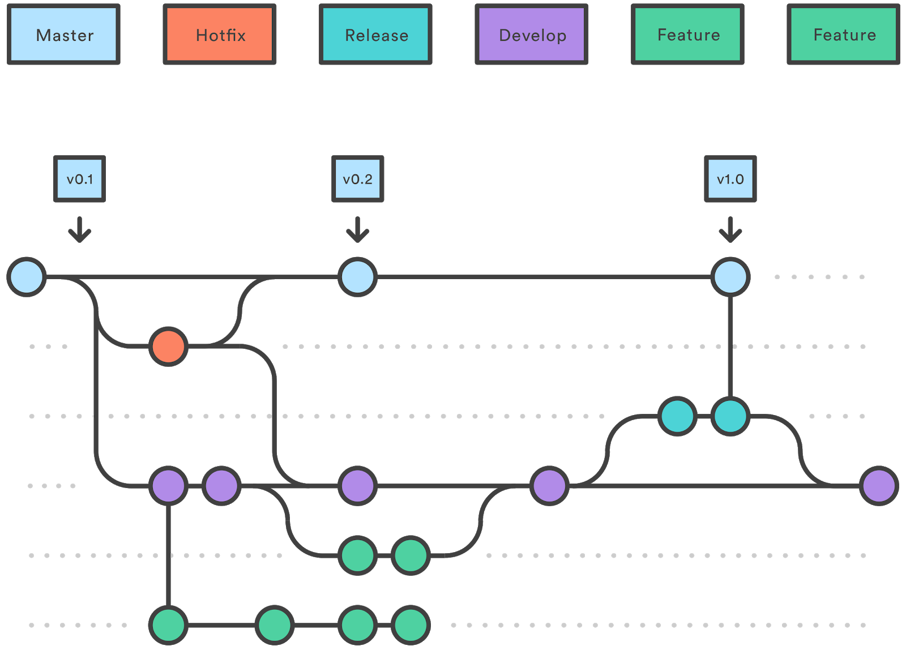

---

The ​master​ branch stores the official release history, and the ​develop​ branch serves as an integration branch for features. It's also convenient to tag all commits in the master branch with a version number.

Features should never interact directly with master.

Once develop has acquired enough features for a release (or a predetermined release date is approaching), you fork a release branch off of develop​. ​Creating this branch starts the next release cycle, so no new features can be added after this point—only bug fixes, documentation generation, and other release-oriented tasks should go in this branch​. ​Once it's ready to ship, the release branch gets merged into master and tagged with a version number. In addition, it should be merged back into develop, which may have progressed since the release was initiated.

Maintenance or “hotfix” branches are used to quickly patch production releases.

---

### Forking Workflow

As in the other ​Git workflows​, the Forking Workflow begins with an official public repository stored on a server. But when a new developer wants to start working on the project, they do not directly clone the official repository. Instead, they ​fork​ the official repository to create a copy of it on the server.

It's important to note that "forked" repositories and "forking" are not special git operations. Forked repositories are created using the standard ​git clone​ command. Forked repositories are generally "server-side clones" and usually managed and hosted by a 3rd party Git service.

---

# Questions?

bucchiarone@fbk.eu

