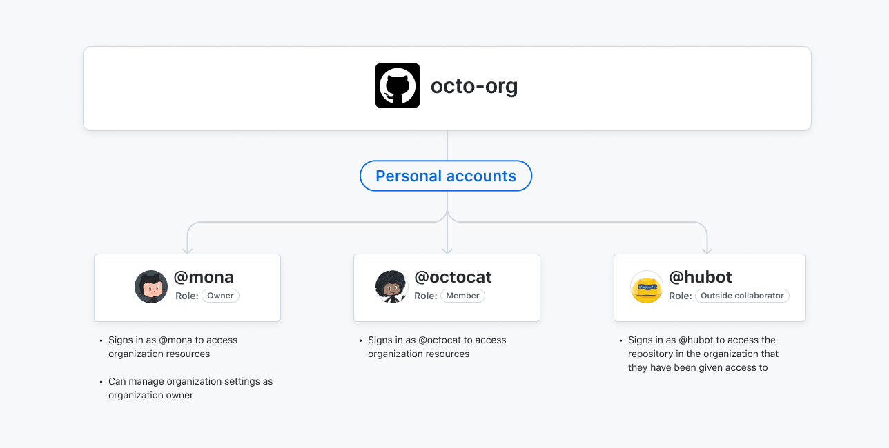
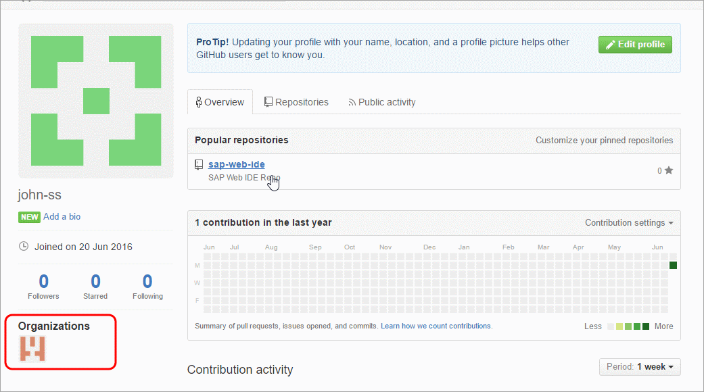

# **GitHub - Authentication and Organizations**

Software Engineering - Tutorial

#### Dr. Antonio Bucchiarone - bucchiarone@fbk.eu

*Academic year 2022/2023*

---

# Tutorial Lectures of this course [*]

- Git - Versioning and collaboration with Git and Github
- Database: MongoDB - Mongoose
- Backend: JavaScript- WebAPI - NodeJS - Express - apiary.io (WebAPIs documentation)
- FrontEnd - Vue.js
- Agile and DevOps: Kanban
- Testing - Jest
- CI/CD - Heroku

[*]: Thanks to Marco Robol @Unitn for some of the material used during these tutorials.

---

# Contents of today class

- GitHub Authentication
- Organization

### Tools and references

- GitHub (https://github.com) 
- GitHub Organizations (https://docs.github.com/en/organizationss)
- Git Tutorial (https://www.atlassian.com/git/tutorials)
- Tutorials Slides and Material: https://github.com/antbucc/IS-22_23/

---
# Using HTTPS with a personal authentication token or a password
The standard way to interact with a repository is via HTTPS. You can clone a repository using HTTPS like this:

`git clone https://github.com/ACCOUNT/REPO`

- You'll be asked to enter your username and password (where the latter could be either your GitHub password or your personal authentication token).

- As of fall 2021, GitHub will no longer allow usage of a password alone. One good option is to use a personal authentication token in place of a password.

---
# Verify your email address
 - In the upper-right corner of any page, click your **profile photo**, then click **Settings**.
 - In the **Access** section of the sidebar, click  **Emails**.
 - Under your email address, click **Resend** verification email.
 - GitHub will send you an email with a link in it. After you click that link, you'll be taken to your GitHub dashboard and see a **confirmation banner**.

---
# Creating a Token
- In the upper-right corner of any page, click your **profile photo**, then click **Settings**.
- In the left sidebar, click  **<> Developer settings**.
- In the left sidebar, click **Personal access tokens**.
 - Click **Generate new token**.
 - Give your token a **descriptive name** (Ex. SE-Project Token).
 - Give your token an **expiration**, select the Expiration drop-down menu, then click a default or use the calendar picker.
 - Select the **scopes**, or permissions, you'd like to grant this token. To use your token to access repositories from the command line, select repo.
 - Click **Generate token**.
---
# Using a token on the command line

- Once you have a token, you can enter it instead of your password when performing Git operations over HTTPS.

- For example, on the command line you would enter the following:

`git clone https://github.com/username/repo.git`
`Username: your_username`
`Password: your_token`

---

# About accounts on GitHub

With GitHub, you can store and collaborate on code. Accounts allow you to organize and control access to that code. There are three types of accounts on GitHub.

- Personal accounts
- Organization accounts
- Enterprise accounts

Every person who uses GitHub signs into a personal account. An organization account enhances collaboration between multiple personal accounts, and an enterprise account allows central management of multiple organizations.

---

# Organization Accounts

Organizations are shared accounts where an unlimited number of people can collaborate across many projects at once.

Organizations can own resources such as repositories, packages, and projects. However, you cannot sign into an organization. 

Each person signs into their own personal account, and any actions the person takes on organization resources are attributed to their personal account. 

The personal accounts within an organization can be given different roles in the organization, which grant different levels of access to the organization and its data. All members can collaborate with each other in repositories and projects.

Only organization owners and security managers can manage the settings for the organization.

---

# Organization Members

---

# Create an organization in GitHub

- Go to GitHub
- Click **Sign In**, enter your account credentials, and click **Sign In**
- Click the **+** icon on the top-right corner and click **New organization**.
- Enter the **organization name**, billing **email**, and click **Create an Organization**.

---
### Organization Elements
If you already have an organization, click the organization name under the profile.

---

- Add **Members**
- Assign **role** to collaborators
- Collaborator **joins** organization
- **Create a New repository** in the Organization

---
### Initialize local repository and push a new doc

`mkdir SE2022-2023`
`cd SE2022-2023`
`git clone https://github.com/SE2022-2023/Reports.git`
`cd Reports`
`create a Word Document and saves it in the Reports Folder`
`git add .`
`git commit -m "first draft of the project objectives"`
`git push`
`git status`

---
### Create new issue in GitHub
- Go to your GitHub organization repository.
- Enter in your specific Repository
- Click on the **Issues tab**, and then click on **New Issue** to create a new issue.
- In this instance, you will create 1 issue,
    -- to add one specific section (the Introduction) in the word document,
- Click Labels and set it as "documentation". 

Labels can be used to categorize issues into bug/enhancements. You can make your own custom labels.

---
### Create/Assign deadlines for milestones to issues
You can assign deadlines for milestones.
-  create a Milestone with its **Title**, **Due Date**, **Description**
    - Ex: "M1 - Project Objective Definition", "24/09/2022", "detailed description"
- click the **Issues** tab of your GitHub organization repository, 
- select the specific **issue** and relate to it the specific milestone.
- Modify the Word Document locally

`git add .`
`git commit -m "Document with project objectives revised"`
`git push`

---
You can use issues for a wide range of purposes. For example:

 - Tracking ideas
 - Collecting feedback
 - Planning tasks
 - Reporting bugs

---
 ### Creating a branch to work on an issue
 - On GitHub.com, navigate to the main page of the repository.
 - Under your repository name, click  Issues.
 - In the list of issues, click the issue that you would like to create a branch for.
 - In the right sidebar under "Development", click Create a branch.
  - By default, the new branch is created in the current repository from the default branch. Edit the branch name and details as required in the "Create a branch for this issue" dialog.
- Choose whether to work on the branch locally and Click "Create branch"
---

`git fetch origin`
`git checkout 1-add-introduction-to-the-objective-document`

---

### Pull Requests
- Pull requests let you tell others about **changes you've pushed to a branch in a repository** on GitHub.
- Once a pull request is opened, you can **discuss** and **review** the potential changes with collaborators
 - **follow-up commits** can exist before your changes are merged into the base branch.

  - Create a pull request associated to an open issue
 

---

# Questions?

bucchiarone@fbk.eu
