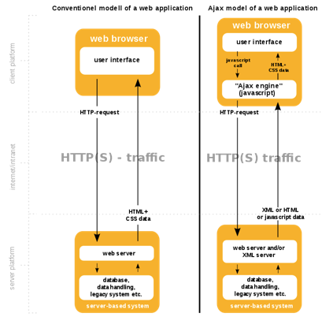
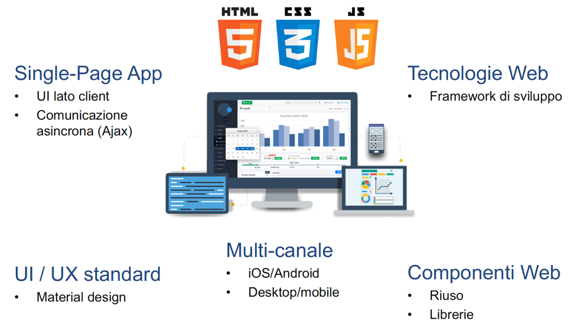
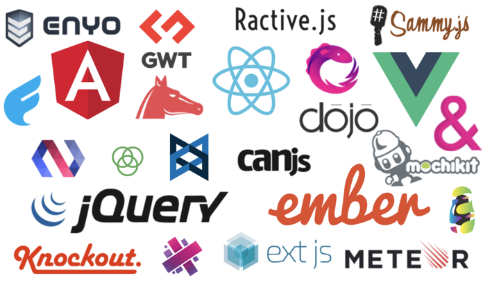
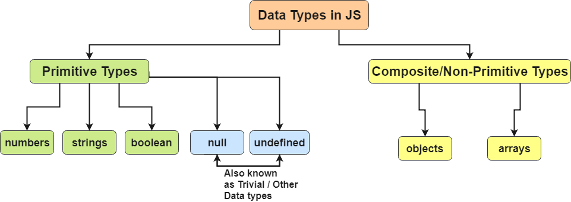
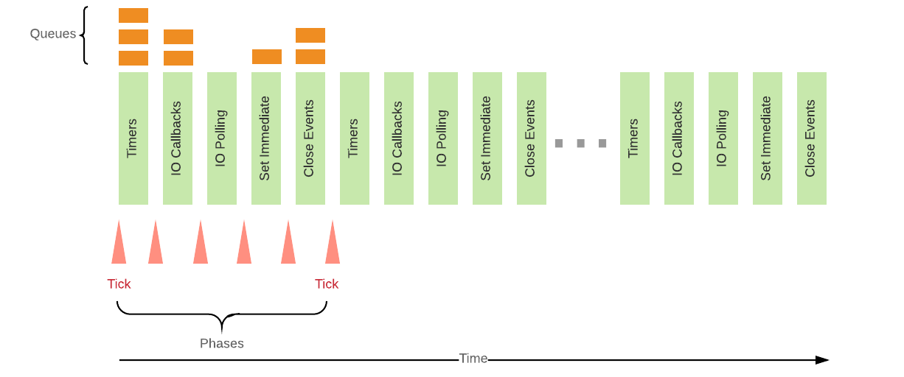

# **Javascript**

Software Engineering - Tutorial

#### Antonio Bucchiarone - bucchiarone@fbk.eu

*Academic year 2022/2023*

---


# Web 2.0

Se il Web 1.0 è associabile alla prima fase di sviluppo del web, in cui pagine statiche collegate da hyperlink compongono la maggior parte dei contenuti fruibili sul web, con il web 2.0 i contenuti vengono offerti come servizi, nascono le **Web Application**!

- ***Disponibilità e facilità di accesso*** - basta una connessione Internet, un dispositivo mobile o desktop e un browser.
- ***Condivisione*** - Tanti utenti, stessi dati.
- ***Tecnologie standard*** - Sviluppo semplice.

---

## AJAX (Asynchronous JavaScript and XML)

AJAX ha reso possibile la transizione verso il web 2.0. Definisce un *pattern standard per la comunicazione tra il back-end ed il front-end* di applicazioni web. Sviluppato sulla base di *tecnologie esistenti* quali:

- **HTML e CSS** - Definiscono la grafica del front-end
- **Javascript e DOM** - Permettono lo sviluppo di UI dinamiche e interattive
- **XMLHttpRequest** - Api supportata dai "moderni" browser che permette alla pagina web di comunicare con un backend o con servizi terzi
- **Backend** - Linguaggi di scripting (php) o linguaggi programmazione (Servlet Java, Node.js, ...)
- **Web API e servizi RESTful** - scomposizione delle applicazioni in moduli

> http://www.adaptivepath.org/ideas/ajax-new-approach-web-applications/

---

# Un web più dinamico con le Web Application

- Grazie al **DOM**, è possibile integragire con gli elementi di una pagina html e modificarli in tempo reale, ad esempio come reazione ad input dell'utente.

- Con l'introduzione di **XMLHttpRequest**, è possibile comunicare con un server web dall'interno di una pagina - ***Nel web 1.0 i contenuti sono parsati dal back-end in pagine statiche*** inviate poi al browser. Con il ***web 2.0, il codice javascript del client contatta il back-end per poi integrare i dati nel DOM*** della pagina. Il browser inotra le chiamate XMLHttpRequest effettuate dalla pagina restituendo poi le risposte.

---



---

# Applicazioni Web: Oggi





---

# Javascript and Node.js

> ***developer.mozilla.org/javascript*** - JavaScript (JS) is a **lightweight**, **interpreted**, or just-in-time compiled programming language with **first-class functions**. While it is most well-known as the **scripting language for Web pages**, many non-browser environments also use it, such as **Node.js**. JavaScript is a **prototype-based**, **multi-paradigm**, **single-threaded**, dynamic language, supporting *object-oriented, imperative, and declarative (e.g. functional programming) styles*.


> [***Node.js***](https://nodejs.org/en/) is a server-side platform built on Google Chrome's JavaScript Engine (V8 Engine). Node.js uses an **event-driven**, **single threaded**, **non-blocking I/O model** that makes it lightweight and efficient, perfect **for data-intensive real-time applications** that run across distributed devices.

---

# Software needed for coding

- Web Browser
- Node.js (https://nodejs.org/it/download/) (with npm included)
- Editor (e.g. Visual Studio Code, Brackets, Sublime Text,...)
- Postman (https://www.postman.com/downloads/)
- apiary.io - create an account
- Git CLI (https://git-scm.com/downloads)
- github.com - it is possible to have a pro account with the @unitn email)


---

# Contents of today class

- **Basics scripting** - types, variables, loops, functions, classes
- **Advanced - Node.js** - Asynchronous programming, non-blocking callbacks, promises, async/await
- **NPM** - Node Package Manager

##### Resources

- General references for Javascript: https://www.w3schools.com/js/
- General references for Node.js: https://nodejs.org/en/docs/
- Lab repository: https://github.com/unitn-software-engineering/2022-se-lab/

---

# Javascript basics

---

## Basic scripting

Let's open our editor and create a file named *hello.js*

```javascript
/* Hello World! program in Node.js */
console.log("Hello World!");
```

Running the script
```javascript
$ node hello.js
```

As you can see, we are simply echo-ing the contents in the console. We can achieve the same using the interactive console by simply typing *node* in our terminal. For example:

```javascript
$ node
> console.log("Hello World!");
Hello World!    // this is the result of executing console.log()
undefined       // this is the returned value from console.log()
```

---

# Structure of a JS script.js

Sequence of statements:
```javascript
// declaration of variables - JavaScript is an untyped language!
const a;  var b; let c;

// declaration of a function (first-class citizens)
function sum(a,b) {}
var result = sum(a, b);

// control flow statements
if (true) {} else if () {} else {}
for (let i=0; i<10; i++) {}
while (true) {}
...
```

---

## Scope of variables

global scope
```javascript
const me = 'me';    // outside of any function or block
```

function scope
```javascript
function myF () { const me = 'me'; }
console.log(me)     // ReferenceError
```

block scope
```javascript
const year = 2023;
if (year > 2022) { const me = 'me'; var you = 'you';
    console.log(you)   // you
    console.log(me)
}
```

---



---

## Types

```javascript
var myvar;
console.log(typeof (myvar));            // undefined

myvar = 'Pippo';                        // string
myvar = 5;                              // number
myvar = true;                           // boolean
myvar = [1,2,3];                        // object
myvar = {key1: "value1"};               // object 
myvar = null;                           // object 
myvar = function(n){return n+1};        // function

console.log(Array.isArray([1,2,3]));    // true
```
---


## Array

```javascript
var list = ["apple", "pear", "peach"];  //list of elements
list[0]                                 // accessing an element by id
list.indexOf("pear")                    // checking the index of "pear" in the array
list.push("banana");                    // Adding a new element
list.pop()                              // Taking the last element from the array
list.shift()                            // Taking the first element
list.length                             // checking the number of elements
list.slice(start, end)                  // copy a subportion of the original array
list.join('separator')                  // return string by concatening elements
```

https://developer.mozilla.org/en-US/docs/Web/JavaScript/Reference/Global_Objects/Array

---

## Logical operator

```javascript
// equality
2 == 2    // true
2 == '2'  // true

// inequality
2 != 2    // false
2 != '2'  // false

// strict equality
2 === 2   // true
2 === '2' // false

// strict inequality
2 !== 2   // false
2 !== '2' // true
```

---

## Matematical operators

```javascript
// greater than
3 > 2   // true
// less than 
3 < 5   // true
// greater than or equal to
3 >= 3  // true
// less than or equal to
3 <= 3  // true
```

---

### Loops

```javascript
while (condition) { console.log('do') }
```
```javascript
for (var i=0; i< 100; i++) {    
    if ((i%2)==0) continue;     // if even, skip to the next cycle
    console.log(i);             // else, print i
    if (i>=10) break;           // when greater equal then 10, quit the loop
}
```
```javascript
for (let value of ['first','second']) {
    console.log(value)          // value is the item in the array
}
```
```javascript
[1,2,3].forEach( console.log )      // callback receives the item as parameter 

[1,2,3].forEach( v=>console.log(v) )// callback defined as an arrow function
```

---

## Functions

How to define a function

```javascript
function add(a, b) {
    return a + b;
};

var mult = function (a, b) { return a * b * this; };

var arrowFunction = (a,b) => a * b;
```

How to call a function

```javascript
add(1,2)            //3
mult.bind(2)(2,2)   //8 - bind() specifies a value for the keyword this.
```

> See also [.bind()](https://developer.mozilla.org/en-US/docs/Web/JavaScript/Reference/Global_Objects/Function/bind) and [.call()](https://developer.mozilla.org/en-US/docs/Web/JavaScript/Reference/Global_Objects/Function/call)

---

## Objects

Define an object without defining the class

```javascript
var car = {
    type : 'Fiat',
    model : '500',
    color : 'red',
    description : function() {
        return this.color + ", " + this.model + ", " + this.type;
    }
    // methods cannot be defined using arrow functions!
    // in the case of arrow functions, context 'this' is not assotiated to the object
}
console.log(car);
console.log(car.description());
```

---

## Define a class by using the new reserved 'class' keyword of ES6

```javascript
class Car3 {
    constructor(type, model, color) {
        this.type = type;
        this.model = model;
        this.color = color;
    }
    description() {
        return this.color + ", " + this.model + ", " + this.type;
    };
}
var fiatPuntobianca = new Car3('Fiat', 'Punto', 'white');
console.log(fiatPuntobianca);
console.log(fiatPuntobianca.description());

```

---

## Extend a class with ES6

```javascript
class Suv extends Car3 {
    description() {
        return this.color + ", " + this.model + ", " + this.type + ", SUV";
    };
}
var NissanQuashqai = new Suv('Nissan', 'Quashqai', 'black');
console.log(NissanQuashqai);
console.log(NissanQuashqai.description());
```

---

## Exercises

Arrays: n3 and n8 - https://medium.com/@andrey.igorevich.borisov/10-javascript-exercises-with-arrays-c44eea129fba

Functions: n18 - https://www.w3resource.com/javascript-exercises/javascript-functions-exercises.php

---

# Advanced

---

# Node.js

[***Node.js***](https://nodejs.org/en/) is a server-side platform built on Google Chrome's JavaScript Engine (V8 Engine). Node.js uses an **event-driven**, **single threaded**, **non-blocking I/O model** that makes it lightweight and efficient, perfect **for data-intensive real-time applications** that run across distributed devices.

> https://nodejs.org/en/docs/guides/
> https://www.w3schools.com/nodejs/default.asp

---

# Installing Node.js

You can install Node.js by following the instructions from the Node.js project webpage ([https://nodejs.org/en/](https://nodejs.org/en/)).

If you're using a package manager in your OS, you might find ports already available. For example:
- [Installing nodejs using MacPorts](https://jonlabelle.com/snippets/view/shell/install-nodejs-macport). 
- [Installing nodejs in Ubuntu](https://websiteforstudents.com/install-the-latest-node-js-and-nmp-packages-on-ubuntu-16-04-18-04-lts/)
- If you're using anything else, you probably know what you're doing :)

---

### Basic scripting

Let's open our editor and create a file named *hello.js*

```javascript
/* Hello World! program in Node.js */
console.log("Hello World!");
```

Running the script
```javascript
$ node hello.js
```

As you can see, we are simply echo-ing the contents in the console. We can achieve the same using the interactive console by simply typing *node* in our terminal. For example:

```javascript
$ node
> console.log("Hello World!");
Hello World!    // this is the result of executing console.log()
undefined       // this is the returned value from console.log()
```

---

### Command line parameters

Often you need to access to command line parameters. For example, 

```shell
$ node evennumbers.js <from> <to>
```

In node.js you do this by accessing *process*, which is a global variable containing informationan about the current node.js process. For example:

```javascript
for (var i = 0; i < process.argv.length; i++) {  
    console.log(i + ' -> ' + (process.argv[i]));
}
```

---

### Accessing the file system

Another useful feature is accessing the file system. Let's start right away from an example:

```javascript
// Loading the file system library
var fs = require("fs");
// File name from the common line params
var fileName = process.argv[2];
// Accessing the content of the file synchnously  
var data = fs.readFileSync(fileName, "utf8");
console.log(data);
```

Now try running the code

```shell
node files.js path/to/file
```

There are two things to highlight in the above code.

---

#### a. Loading libraries 
To access the file system we need to load the File System module. This module comes with the standard Node.js installation, so we do not need to install any third-party libraries (We'll get to that later in this tutorial).

```javascript
var fs = require("fs");
```

The require instruction above loads the module "fs" and assigns an instance to the variable fs. Through this instance then we can have access to all the funcions exported by that module. 

For more on how require works, [check this interesting blog post](http://fredkschott.com/post/2014/06/require-and-the-module-system/).

---

#### b. Blocking / synchronous call
As you might have noticed, the following operations are exececuted in sequence, meaning that you see the contents of the file and then the "Program ended." message.

```javascript
var data = fs.readFileSync(fileName, "utf8");
console.log(data);

console.log("Program ended.");
```
This happens because the *readFileSync* functions is a synchronous implementation, that make the process to wait until the funcion finished its operation to continue. However, this is typically an undesired feature, and as you will see Node.js is built around the concept of non-blocking / asynchonous calls.

Why do you think this un undesired feature. Can you think of any instances where you'd need a non-blocking implementation?

---

### Non-blocking calls
Let's try now an alternative implementation of our files script, the *files-async.js*.

```javascript
// Loading the file system library
var fs = require("fs");

// File name from the common line params
var fileName = process.argv[2];

// Accessing the content of the file asynchnously  
fs.readFile(fileName, "utf8", function(error, data) {
  console.log(data);
});

console.log("Program ended.");
```

---

What is the difference now?

In this case readFile expects a *callback* function. These are very common in javascript libraries, and is the function that will be called when the method invoked realises its purpose (which can be one or multiple times). In this specific case, we also have an anonymous function, meaning a function that was declared on the spot (declared at runtime) and that unlike typical functions, it does not have a name.

Later in the tutorial we'll have a look at *Promises*, which are a nicer looking alternatives to callback functions for asynchnous calls.

---

## Blocking vs Non-Blocking

https://nodejs.org/en/docs/guides/blocking-vs-non-blocking/

Blocking is when the execution of additional JavaScript must wait until a non-JavaScript operation completes. This happens because the event loop is unable to continue running JavaScript while a blocking operation is occurring. Blocking methods execute synchronously and non-blocking methods execute asynchronously.

```javascript
const fs = require('fs');
const data = fs.readFileSync('/file.md'); // blocks here until file is read
```

```javascript
const fs = require('fs');
fs.readFile('/file.md', (err, data) => {
  if (err) throw err;
}); // continue executing the javascript code while waiting for the file
```

---

## Callbacks

https://nodejs.org/en/knowledge/getting-started/control-flow/what-are-callbacks/

In a synchronous program, you would write something along the lines of:

```javascript
var data = fetchData (); // block the whole program waiting for the data
console.log(data); // do something with the fetched data
```
A callback is a function called at the completion of a given task; this prevents any blocking, and allows other code to be run in the meantime.

```javascript
fetchData(function (data) {
    console.log(data); // do something with the fetched data
});
```

Node.js, being an asynchronous platform, uses callbacks to avoid waiting for things like file I/O to finish.

---

## The Node.js Event Loop


https://medium.com/the-node-js-collection/what-you-should-know-to-really-understand-the-node-js-event-loop-and-its-metrics-c4907b19da4c

---

## Promises

There are different ways to handle operations in NodeJS or in JavaScript. For asynchronous execution, different processes run simultaneously and are handled once the result of each process is available. There are different ways to handle the asynchronous code in NodeJS or in JavaScript which are:

-Callbacks
-Promises https://web.dev/promises/
-Async/Await

https://www.geeksforgeeks.org/difference-between-promise-and-async-await-in-node-js/#:~:text=Promise%20is%20an%20object%20representing,%E2%80%93%20resolved%2C%20rejected%20and%20pending.

---

### A promise is an object having three possible states:

- Pending: Initial State, before the event has happened.
- Resolved: After the operation completed successfully.
- Rejected: If the operation had error during execution, the promise fails.

A Promise in NodeJS is similar to a promise in real life. It is an assurance that something will be done. Promise is used to keep track of whether the asynchronous event has been executed or not and determines what happens after the event has occurred.

```javascript
var myPromise = new Promise(function (res) {
    // async code to be executed, when ready, call res() to resolve the promise
    res('any_value');
});
// when not yet resolved
console.log(myPromise);      //Promise { <pending> }
// once resolved
console.log(myPromise);      //Promise { 'any value' }
```

---

For a successfully resolved promise, we use .then() method and for rejected promise, we use .catch() method. To run a code after the promise has been handled using .then() or .catch() method, we can .finally() method. The code inside .finally() method runs once regardless of the state of the promise.

```javascript
promise
    .then(function () {
      console.log("Promise resolved successfully");
    })
    .catch(function () {
      console.log("Promise is rejected");
    });
```

Callbacks vs. Promises: 

```javascript
callbackBasedFunction(callbackWithErrorHandling)

promiseBasedFunction.then(callback).catch(errorHandling)
```

---

#### Example with timeout
Suppose we want a sequence of timeouts. With callback-based setTimeout() we have:

```javascript
setTimeout(()=>{
    setTimeout(()=>{
            console.log(123)
        }, 5000)    // later, wait for another 5 seconds
}, 1000)    // first wait 1 second 
```

After promisifing the setTimeout:

```javascript
myPromisifiedTimeout = function (time) {
    return new Promise( (res) => setTimeout(res, time) ) 
}
```
```javascript
myPromisifiedTimeout(1000)              //first wait for 1 second
.then(()=>{return myPromisifiedTimeout(5000)})   // later wait for additional 5
.then(()=>console.log(123))
```

---

Example: While accessing a file, the Promise is in a pending state. The Promise is resolved after reading the file, or rejected if file could not be read. 

```javascript
const fs = require('fs');

const readPromisify = function (file) {
    return new Promise(function (resolve, reject) {
        fs.readFile(file, (err, data) => {
            if (err) throw reject(err);
            resolve(data); data
        });
    });
}

readPromisify('/file.md')
.then(function (data) {
      console.log("Promise resolved successfully");
})
.catch(function (err) {
    console.log("Promise is rejected");
});
```

---

Error Handling of Promises: For a successfully resolved promise, we use .then() method and for rejected promise, we use .catch() method. To run a code after the promise has been handled using .then() or .catch() method, we can .finally() method. The code inside .finally() method runs once regardless of the state of the promise.

```javascript
promise
    .then(function (value) {
      console.log("Promise resolved successfully");
    })
    .catch(function (err) {
      console.log("Promise is rejected");
    });
```

---

## Asynch/await

https://javascript.info/async-await

The word “async” before a function means one simple thing: a function always returns a promise. Other values are wrapped in a resolved promise automatically.

```javascript
async function f() { return 1; }
f().then(alert); // 1
```

Await works only inside async functions. It waits for a promise to resolve, then return resolved value.

```javascript
async function f() {
  let result = await promise; // wait until the promise resolves (*)
  alert(result); // "done!"
}
```

---

### Example 

```javascript
function example() {
    myPromisifiedTimeout(1000)              //first wait for 1 second
    .then(()=>{return myPromisifiedTimeout(5000)})   // later wait for additional 5
    .then(()=>console.log(123);)
}
example();
```
```javascript
async function asyncExample() {
    await myPromisifiedTimeout(1000);   //first wait for 1 second
    await myPromisifiedTimeout(5000);   // later wait for additional 5
    console.log(123);
}
asyncExample();
```

---

## Exercises

- Promises and async programming https://www.codingame.com/playgrounds/347/javascript-promises-mastering-the-asynchronous/what-is-asynchronous-in-javascript

---

# Package mangement

> https://docs.npmjs.com/getting-started/what-is-npm

---

## Loading libraries 

The Node.js installation comes with standard modules, e.g. 'fs' to access the file system. This module comes with the standard Node.js installation, so we do not need to install any third-party libraries (We'll get to that later in this tutorial).

```javascript
var fs = require("fs");
```

The require instruction above loads the module "fs" and assigns an instance to the variable fs. Through this instance then we can have access to all the functions exported by that module. 

> http://fredkschott.com/post/2014/06/require-and-the-module-system/.

---

## Creating and Exporting a Module

./user.js
```javascript
function userTemplate(user) {
  return `Name: ${user.name}`;
}
module.exports = userTemplate;
```
./index.js
```javascript
const userTemplate = require('./user');
console.log( userTemplate({name:'marco'}) );
```

> https://www.sitepoint.com/understanding-module-exports-exports-node-js/

---

## Package mangement with npm

NPM is a very powerful tool that can help you manage project dependencies and in general automate development workflows, much like `ant` or `make` in java and C.

The file `package.json` contains the metadata regarding your project, including name, version, license, and dependencies. Although you can install dependencies without a `package.json` file, it is the best way to keep track of your local dependencies.

> https://nodesource.com/blog/an-absolute-beginners-guide-to-using-npm/

---

### Package.json

How do we start? We execute the command below and follow the instructions prompted. 

```shell
npm init
```

This generates the `package.json` file.

---

### Installing modules

To install an external module, we can use the `npm install` command

```shell
npm install express
```

The save params indicates npm to add the module to the list of dependencies in the `package.json` file. Indeed, if you check its contents, you'll now see: 

```json
{
  "name": "hello",
  ...
  "dependencies": {
    "express": "^4.16.3"
  }
  ...
}
```

---

### Installing all npm dependencies

When someone shares the source code of their project (on a github, other source code management system, but even on a memory stick), they will not put their local dependency builds with their source code but give you only the `package.json` dependecies. 

Let us "uninstall" express for a second, using `npm uninstall express` (if you add --save you'll also remove it from `package.json` but that's not what we want in this case). This removes the module from our project, and put it at the state you'll find any project on github. The way you install the dependencies of the project is then with the following command.

```shell
npm install 
```

---

# Questions?

bucchiarone@fbk.eu