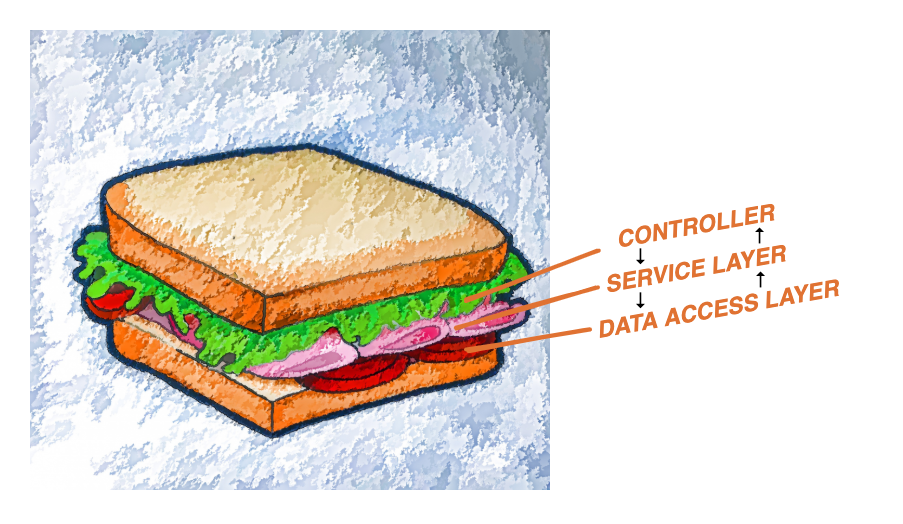
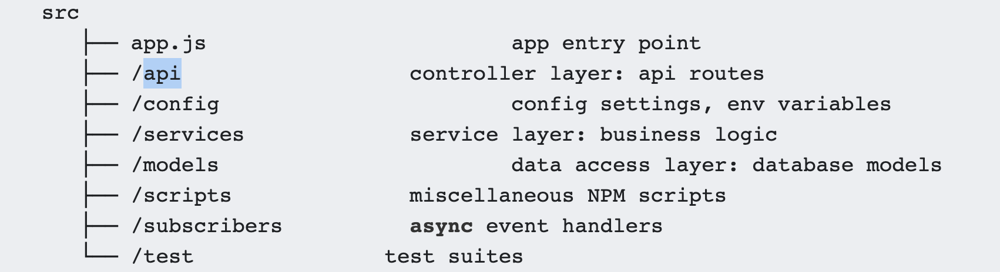
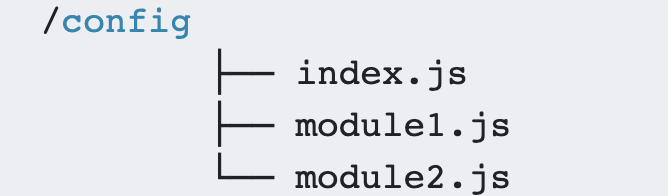
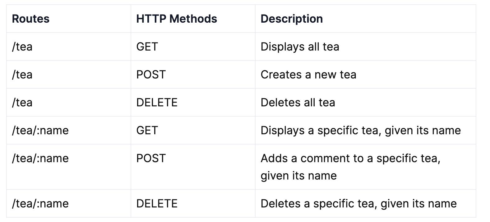
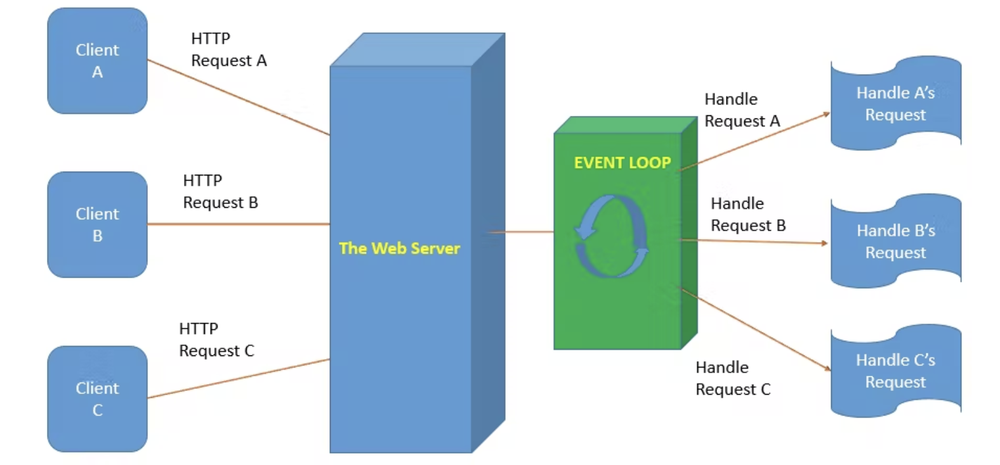
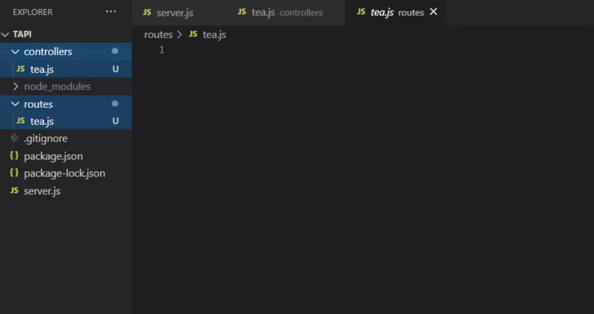
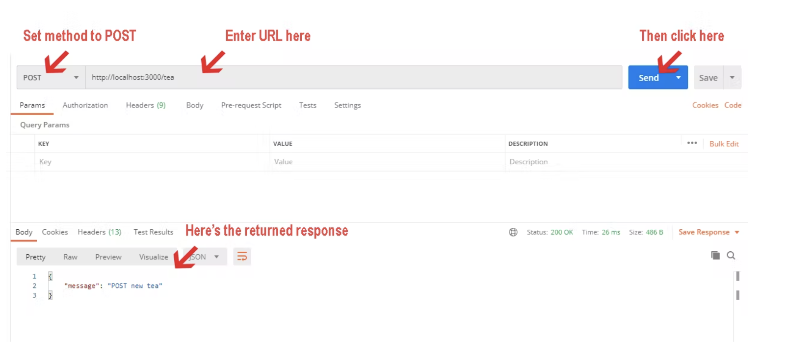
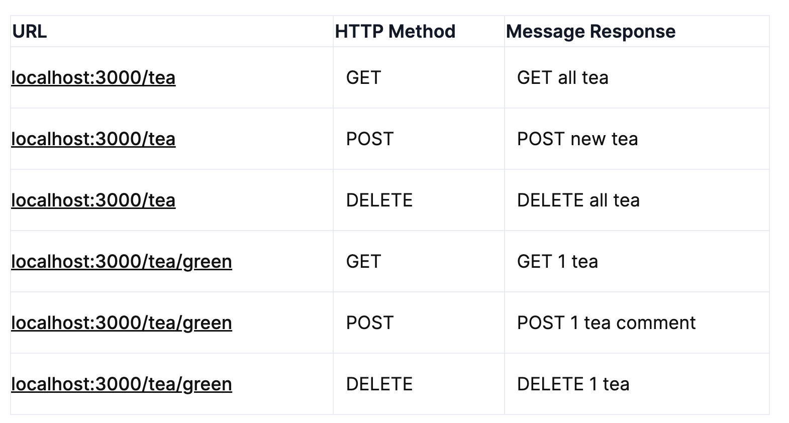
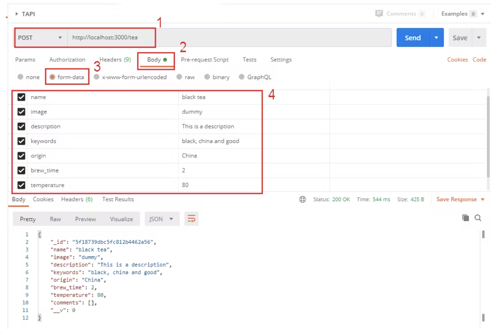
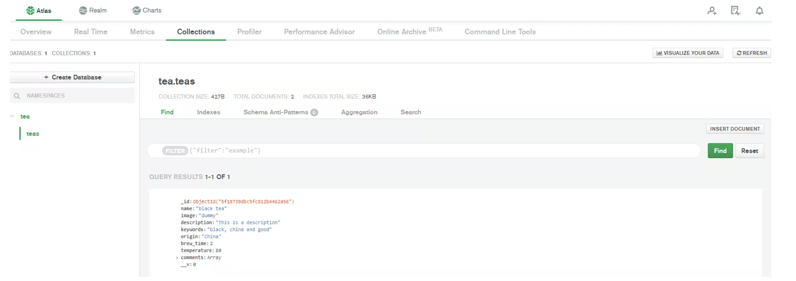

# **WebAPIs with Express (Node.js) and apiary.io**

Software Engineering - Tutorial

#### Antonio Bucchiarone - bucchiarone@fbk.eu

*Academic year 2022/2023 - First semester*

---

# Contents of today class

- Express https://expressjs.com/
- WebAPIs
- apiary.io

> Lab repository: https://github.com/antbucc/IS-22_23

---

# Node.js

> [***Node.js***](https://nodejs.org/en/) is a server-side platform built on Google Chrome's JavaScript Engine (V8 Engine). Node.js uses an **event-driven**, **single threaded**, **non-blocking I/O model** that makes it lightweight and efficient, perfect **for data-intensive real-time applications** that run across distributed devices.

You can install Node.js by following the instructions from the Node.js project webpage ([https://nodejs.org/en/](https://nodejs.org/en/)).

If you're using a package manager in your OS, you might find ports already available. For example:
- [Installing nodejs using MacPorts](https://jonlabelle.com/snippets/view/shell/install-nodejs-macport). 
- [Installing nodejs in Ubuntu](https://websiteforstudents.com/install-the-latest-node-js-and-nmp-packages-on-ubuntu-16-04-18-04-lts/)
- If you're using anything else, you probably know what you're doing :)

---

## Best Practice #1: Take a Layered Approach  - Separate your concerns.


---
- Popular Node.js frameworks like Express.js allow you to define **route handlers** as callback functions that are executed when a **client request** is received.
- we should have different **modules** for addressing **different concerns** pertinent to our application. 
- different **modules (or layers)** should take the responsibility of catering to different aspects of processing a **response for a client request**

- Client request ➡️ Some business logic + some data(base) manipulation ➡️ Returning the response

---



---
- Controller
  - (API routes and endpoints)
- Service layer
  - (for business logic)
- Data access layer
  - (for working with a database)

---
## Controller layer 🎮
 - This is the module of your code where the API routes are defined. Here you define only, and only your API routes. In the route handler functions, you can deconstruct the request object, pick the important data pieces and pass them to the service layer for processing.

## Service layer 👩🏽‍🏭 🏭
  - This is where your business logic lives, even the secret sauce of your application. It contains a bunch of **classes** and **methods** that take up singular responsibility and are reusable. This layer allows you to effectively decouple the **processing logic** from where the routes are defined.  
  - One more aspect to consider here is the database part. To independently deal with this, we need one more layer.

---

## Data Access Layer 🌐
 - The Data Access layer can take up the responsibility of talking to the database - fetching from, writing to, and updating it. All your  **queries**, **database connections**, **models**, etc. are supposed to be defined here.

---

## Best Practice #2: Folder structure 🗂 Properly organize your code files.

---
> The Layered "abstract" architecture can be realized through a proper **folder structure** that separates different **modules** into different **folders**.

> This provides clarity about **which** functionality is managed **where**, and allows us to organize our **classes** and **methods** into separate **containers** that are easier to manage.

---



> The /scripts directory can be used to store **workflow automation scripts for building** (eg. deployment) pipelines

---
 - Create the Project Folder (ex. Demo)
 - npm init
 - Define app.js as app entry point
 - npm install
 - add script  ` "start": "node app.js"` to start the app at the package.json file
 - add `console.log("app started")` in app.js and start the app

--- 
## Best Practice #3: Configuration files and Environment Variables 🌳
> As your app scales, you’ll notice the requirement of certain **global configuration** options and settings to be accessible across all modules.
> It is always a good practice to store these options together in a separate file inside a config folder in your project
> This folder can contain all your different configuration options grouped in files based on their usage.


---
## .env file - Environment Variables

> secure API keys, database connection URLs etc. in the form of **key-value pairs**

```javascript
DB_HOST=localhost
DB_USER=root
DB_PASS=my_password_123
```

> IMPORANT: These .env files are secret files that are not to be (Git) tracked and are therefore not committed or pushed (except for the first time with empty values). 

---


> The environment variables can be accessed in your code using npm’s dotenv package as shown below -
```javascript
// app.js

require('dotenv').config()      

console.log(process.env.DB_HOST) 
console.log(process.env.DB_USER)

```

---

- Create your .env file
- add the DB info
- Import the 'dotenv' package in app.js
- write the code to print in the console the HOST and USER info of the DB
- run the app


--- 
# Step 1: Planning the API to implement

Our API User Stories
 - I can create a new tea object and add it to the database
 - I can get all the tea from the database
 - I can delete all the tea in the database
 - I can get a single tea by querying its name
 - I can post a comment to a single tea
 - I can delete a single tea from the database

---
# Our Tea Object

> Based on our user stories and how we want to use the API, we can draft a sample **tea object** that the API can return. This helps us to decide what properties to include in the object early in the stage of making this API. So, for our API, a tea object might look like:

```javascript

{
    "name": "Jasmine Tea",
    "image": "an image file url",
    "description": "Jasmine tea is tea scented with the aroma of jasmine blossoms.",
    "keywords": "aromatic, china, sweet",
    "origin":"China",
    "brew time": 2,
    "temperature": 80,
    "comments": []
}
```

--- 

# Step 2: Designing Structure for your API
> The way to design an API is to visualize its routes and request methods.



--- 
> Node.js has a built-in HTTP module which it uses to make HTTP requests and transfer data from the server to the client. Here's a diagram illustrating how it works.




---


# WebAPIs development with Express

How to develop a backend server exposing a REST APIs using Express.

---

## Express 

*Express is a minimal and flexible Node.js web application framework that provides a robust set of features for web and mobile applications.* (Source: https://expressjs.com/).

Let's rewrite our web server using *Express*:

```javascript

const express=require('express');
const app=express();


app.get("/", function (req, res) {
  res.send(req.headers, req.originalUrl, req.method, req.body);
});

app.listen(3000, () =>
  console.log('Demo app listening on port 3000!'),
);

```

---

## Routing with Express

There are a few interesting concepts that we can highlight in this trivial example:
- we can listen to specific http verbs (`app.get`)

- we can specify specific routes (`'/'`)

Route definition takes the following structure: `app.METHOD(PATH, HANDLER)`

> https://expressjs.com/en/starter/basic-routing.html

We can focus on the services that we want to implement, without worriying about the logic for handling the request (e.g., checking manually that the request method is GET, and that the request url is '/').

---

## What are controllers?

> Controllers are typically **callback functions** that corresponds to the routers to handle requests. It is a good design principle to keep the code concise and readable. 
>  A sample route might look like: 
```javascript
// Syntax
app.method('<path>', callbackFunction)

// Example
app.get("/", function (req, res) {
  res.json({message: "Hello world!"});
});
```

---
# Step 1: Create folders and files
> In your project's root directory, create 2 folders and name them 'routes' and 'controllers'.

> Then, in each folder, create a 'tea.js' file for our tea route and tea controller. 
> It is a convention to name the controller the same as the route which it is handling.

> Your directory should look like:



---

# Step 2: The First Route and Controller
- Now, open your **routes/tea.js** file. We can create our first route as follows:

 1. Create an express router object to set up our routes
 2. Import our tea controller from our controllers/tea.js file we created earlier
 3. Create our first route with the controller function as the callback to handle the request.
 4. Export the route to use in our server.js

---
```javascript
const express = require('express'); //import express

// 1.
const router  = express.Router(); 
// 2.
const teaController = require('../controllers/tea'); 
// 3.
router.post('/tea', teaController.newTea); 
// 4. 
module.exports = router; // export to use in server.js
```
---

> At this point, we have not yet created the newTea function but we'll do that right now.

 - In controllers/tea.js:
 ```javascript
// newTea function for post tea route
const newTea = (req, res, next) => {
    res.json({message: "POST new tea"}); // dummy function for now
};

module.exports = {newTea};

 ```

--- 

> Now your first **route** and its **controller** is successfully created! 
> Let's add the **routes** to the **server** so that it can access them.

 - Our **server.js**  is now updated with 2 lines:
 ```javascript
 const routes = require('./routes/tea'); //to import the routes/tea.js
 app.use('/', routes); //to use them via express.
```
---

## The Request object

Handling requests headers, url and query parameters can be done easily:

```javascript
// Handling GET requests
app.get('/search', function(req, res){ 
  console.log(util.inspect(req.headers, {showHidden: false, depth: null}))
  console.log(util.inspect(req.url, {showHidden: false, depth: null}))
  console.log(util.inspect(req.query, {showHidden: false, depth: null}))
  res.status(200).send('These are the items found!');  
});
// Handling POST requests
app.post('/subscribe', function(req, res){ 
  console.log(util.inspect(req.headers, {showHidden: false, depth: null}))
  console.log(util.inspect(req.params, {showHidden: false, depth: null}))
  res.status(201).send('You are now subscribed!');
});
```

> https://expressjs.com/en/4x/api.html#req

---

## The response object

```javascript
// text of html
res.send('text')
// json
res.json({ user: 'tobi' })
// status code
res.sendStatus(404)
// chainable status code
res.status(404).sendFile('/absolute/path/to/404.png')
```

> https://expressjs.com/it/api.html#res

#### What about HTTP status codes?

1xx: Informational; 2xx: Success; 3xx: Redirection; 4xx: Client Error; 5xx: Server Error

> https://restfulapi.net/http-status-codes/

---

## Using Postman to test the web server and APIs



---


# Create all routes and API endpoints
```javascript
const express = require('express');
const router  = express.Router();
const teaController = require('../controllers/tea');

router.get('/tea', teaController.getAllTea);
router.post('/tea', teaController.newTea);
router.delete('/tea', teaController.deleteAllTea);

router.get('/tea/:name', teaController.getOneTea);
router.post('/tea/:name', teaController.newComment);
router.delete('/tea/:name', teaController.deleteOneTea);

module.exports = router;


```


---
```javascript
//GET '/tea'
const getAllTea = (req, res, next) => {
    res.json({message: "GET all tea"});
};

//POST '/tea'
const newTea = (req, res, next) => {
    res.json({message: "POST new tea"});
};

//DELETE '/tea'
const deleteAllTea = (req, res, next) => {
    res.json({message: "DELETE all tea"});
};

//GET '/tea/:name'
const getOneTea = (req, res, next) => {
    res.json({message: "GET 1 tea"});
};

//POST '/tea/:name'
const newComment = (req, res, next) => {
    res.json({message: "POST 1 tea comment"});
};

//DELETE '/tea/:name'
const deleteOneTea = (req, res, next) => {
    res.json({message: "DELETE 1 tea"});
};

//export controller functions
module.exports = {
    getAllTea, 
    newTea,
    deleteAllTea,
    getOneTea,
    newComment,
    deleteOneTea
};
```

---
## APIs



---
 ## Connect API to MongoDB
```javascript
 npm install --save mongoose
 ```

 - After installing mongoose, add the following to our **server.js** file:
```javascript
 //import mongoose
const mongoose = require('mongoose');

//establish connection to database
mongoose.connect(
    'mongodb+srv://<username>:<password>@cluster0.eetsx.mongodb.net/<dbname>',
    { useNewUrlParser: true, useUnifiedTopology: true },
    (err) => {
        if (err) return console.log("Error: ", err);
        console.log("MongoDB Connection -- Ready state is:", mongoose.connection.readyState);
    }
);


 ```
---

## For security reasons

- If you are adding this project to a **public repository**, it is best that no one can see the MongoDB URI since we have included our password, a sensitive information, in it. 
- we can create an **.env file** in our root directory and write our URI inside
 ```javascript
MONGODB_URI='mongodb+srv://<username>:<password>@cluster0.eetsx.mongodb.net/tea'
 ```

---

> Back to **server.js**, replace the uri inside **mongoose.connect()** with **process.env.MONGODB_URI** so we can hide this sensitive information.

 ```javascript
 mongoose.connect(
    process.env.MONGODB_URI,
    { useNewUrlParser: true, useUnifiedTopology: true },
    (err) => {
        if (err) return console.log("Error: ", err);
        console.log("MongoDB Connection -- Ready state is:", mongoose.connection.readyState);
    }
);

 ```
---

## Create the Tea Model

- First, create a **'models'** folder. 
- Then, create a **tea.js** file inside the folder. 
- This is where our **tea model** will be.
- Now, let's create a new **schema** inside our models/tea.js file. 
 - Then **export the module** to use in our tea controller.
```javascript
// A sample tea object
{
    "name": "Jasmine Tea",
    "image": "an image file url",
    "description": "Jasmine tea is tea scented with the aroma of jasmine blossoms.",
    "keywords": "aromatic, china, sweet",
    "origin":"China",
    "brew_time": 2,
    "temperature": 80,
    "comments": ["text": "I am a comment", "date": Date String]
}

```

---

```javascript

//Syntax
property: {type: SchemaType (i.e. String, Date, Number), 
                  other options (i.e. default, required)}

//Examples
name: {type: String, required: true}
description: String   //short for {type: String}

```

---

 ## Here's our tea schema (in models/tea.js):
```javascript

const mongoose = require("mongoose"); //import mongoose

// tea schema
const TeaSchema = new mongoose.Schema({
    name: {type:String, required:true},
    image: String,
    description: String,
    keywords: String,
    origin: String,
    brew_time: Number,
    temperature: Number,
    comments: [{ text: String, date: {type:String, default: new Date()} }]
});

const Tea = mongoose.model('Tea', TeaSchema); //convert to model named Tea
module.exports = Tea; //export for controller use


```
---
> Let's import our **tea model** we created into the **controllers/tea.js** 

```javascript
//import tea model
const Tea = require('../models/tea');
```
---
## newTea API

- In this function, we will create a **new tea object** by supplying its key-value pairs to **req.body** and then save it to the database. 

- First, we need to be able to parse **form data** with our Express server. We can install the **multer package** with:
```javascript
npm install --save multer
```

- Import multer to our routes/tea.js file:

```javascript
const multer = require('multer');
const upload = multer();

```
---
- Add **upload.none()** in the route. This enables our newTea function to read our form data.
```javascript
router.post("/tea", upload.none(), teaController.newTea);
```

 - Then, we must make sure we don't accidentally POST a tea with an identical name. 
 - So our newTea function should check if the new tea's name from **req.body.name** has already exists in the database. 
 - If it does, don't add this tea.
 - If it doesn't, then create a new tea object with the key-value pairs from the **req.body**.
 - **Save** the new tea object to the database.
   - To check whether a tea name already exists in the database, we can use a mongoose query method called **findOne()**, which returns one object from the database that matches the condition supplied.

---


 - In **controllers/tea.js**:
```javascript
//POST tea
const newTea = (req, res) => {
    //check if the tea name already exists in db
    Tea.findOne({ name: req.body.name }, (err, data) => {

        //if tea not in db, add it
        if (!data) {
            //create a new tea object using the Tea model and req.body
            const newTea = new Tea({
                name:req.body.name,
                image: req.body.image, // placeholder for now
                description: req.body.description,
                keywords: req.body.keywords,
                origin: req.body.origin,
                brew_time: req.body.brew_time,
                temperature: req.body.temperature,
            })

            // save this object to database
            newTea.save((err, data)=>{
                if(err) return res.json({Error: err});
                return res.json(data);
            })
        //if there's an error or the tea is in db, return a message         
        }else{
            if(err) return res.json(`Something went wrong, please try again. ${err}`);
            return res.json({message:"Tea already exists"});
        }
    })    
};

```
---

## Testing on POSTman

1. Make sure the method is set to POST and the url is correct.
2. Click on the 'Body' tab to access the req.body.
3. Click on the form data radio button below.
4. Supply some test key-value pairs for the req.body.
---


---

>  POSTman returns with the data we posted which means our **newTea** function is working. 
> If you check in **MongoDB**, you will see that it is indeed in our database.


---

## getAllTea API

> To get all tea, our function will retrieve and return all the data from our database using the mongoose built-in find() method. 
> We supply {} as the matching condition so that the all data will be returned.

```javascript
//GET all teas
const getAllTea = (req, res) => {
    Tea.find({}, (err, data)=>{
        if (err){
            return res.json({Error: err});
        }
        return res.json(data);
    })
};

```

---

## deleteAllTea API

> This function will delete all data in the database. 
> We can simply do this with **deleteMany()** and supply the condition parameter with {} since we are deleting everything unconditionally.

```javascript
//DELETE teas
const deleteAllTea = (req, res) => {
    Tea.deleteMany({}, err => {
        if(err) {
          return res.json({message: "Complete delete failed"});
        }
        return res.json({message: "Complete delete successful"});
    })
};

```
---

## getOneTea API

> This function will retrieve and **return only one tea**, given its **name** as the matched condition. 
> We can use **findOne()** for this.
> the server will retrieve the tea object with the name from req.params.name.

```javascript
const getOneTea = (req, res) => {
    let name = req.params.name; //get the tea name

    //find the specific tea with that name
    Tea.findOne({name:name}, (err, data) => {
    if(err || !data) {
        return res.json({message: "Tea doesn't exist."});
    }
    else return res.json(data); //return the tea object if found
    });
};


```
---

# Questions?

bucchiarone@fbk.eu