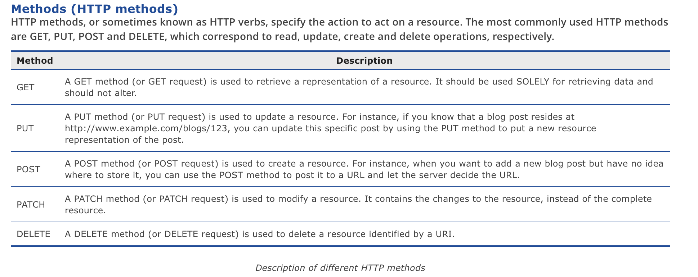

# **From Class Diagram to API Server**

Software Engineering - Tutorial

#### Antonio Bucchiarone - bucchiarone@fbk.eu

*Academic year 2022/2023 - First semester*


---

# Overview

> One of the critical steps in that process is to go from a Class Diagram to implement an API server.

> In this lecture we see all the steps to follow from the Class Diagram to the API Specification and implementation


--- 
# How to Design API with UML?

 - You can design your API by drawing a **class diagram** that represents your resource, the request and response body.

---
# API Resources
- An API **resource** is the fundamental unit of an API.
-  It is an **object** with a URI, the **http** request **method**, **associated parameters** and the **request/response** body. 
- Each of the API resources represents a specific service available on the path specified by its URI property.
- Therefore, if you want to model multiple services, please draw multiple API resources.
---
# API Resource Model
- **URI:**	Each  Resource has its own URI. Consumers access to URL to access for the API Resource.
- **Method:** Specifies the action to act on the resource.
- **Name:** Name of the specified resource


---
# API Resource Methods



---
# API Request Body

> If the Resource uses a **POST**, **PUT**, **PATCH** or **DELETE** method and if **parameter** is required in using the Resource, model the parameters by drawing UML class(es). 


---

# API Request Body Class
> For instance, if we are going to create a member via the **/members** Resource, we need to send the **member's** details to the server for creating a member record. Therefore, name the class **Member** for storing member's details.


---

# API Response

> If the API will return a value or object, a Class Association must be defined.


---

# API GET Parameters

- **Parameters** are referring to query parameters used for passing data to an API. 


---
# Modeling multiple scenarios

- Sometimes, you may need to model multiple scenarios where there could be **multiple** or **different** Response Bodies. 

- For example, you want to define the various **HTTP status codes** that can be returned as well as in some cases you may be returning an Error object embedded within the main response object. 

--- 

# Examples 

```javascript
Case 1:

Response Header:
status : 200 OK

Response Body:
{
   "customer" : {
   "name" : "Peter",
   }
}
```

---
```javascript
Case 2:

Response Header:
status : 400 Bad Request

Response Body:
{
   "customer": {
      "error" : {
      "text" : "Invalid customer name."
   }
}
```

---
> The HTTP standard RFC 2616 is a primary source of information for the meaning of error codes.


---


---
# For Deliverable D4

1. APIs Specification from Class Diagram
2. APIs Implementation and Documentation
3. APIs Testing
4. FrontEnd Implementation
5. Application Deployment
--- 

# APIs Specification from Class Diagram

1. Resources Extraction from the Application Class Diagrams

2. Resources Models


---
# Class Diagram Example


---

# Resources Extraction


--- 

# Exercise (15-20 min)

> Is your turn. Starting from your class diagram try to extract:

    1. At least 2 main resources (i.e., customer, order) and their attributes
    2. For each main resource at least one POST and one GET API
    3. For each API define which has an effect in the Backend and in the Frontend

---
# Resources Models


---
# Exercise (20 min)

> Is your turn. Derive your resource model with at least one GET and one POST API

    1. For each API identify the **Request** and **Response** bodies
    2. Identify the needed parameters for the GET APIs
    3. Identify the needed messages

---
# API "signup" Implementation

1. Create the **Customer** Model for the DB
2. Create the **Customer** Route with the API endpoint
3. Create the **Customer** Controller for the API implementation

--- 

# Customer Data Model - API Data Model

- exploiting the **Class Attributes** of the **customer** Class

```javascript
const mongoose = require("mongoose"); //import mongoose

// customer schema
const CustomerSchema = new mongoose.Schema({
    name: String,
    surname: String,
    email: String,
    address: String
});

const Customer = mongoose.model('Customer', CustomerSchema); //convert to model named Customer
module.exports = Customer; //export for controller use
```

---

# Customer Router - API Endpoint Definition
```javascript
const express = require('express'); //import express

// 1.
const router = express.Router();

const authController = require('../controllers/auth.controller');


router.post('/auth/signup', authController.signup);

// 4.
module.exports = router; // export to use in server.js
```
---

# Customer Controller - API behavior implementation

> Create Controllers
 - Controller for Registration

 There is 1 main function for the registration:
- signup: create new Customer in database


---

# API code to add a new Customer
```javascript
if (!customer) {
        const newCustomer = new Customer({
            name: req.body.name,
            surname: req.body.surname,
            email: req.body.email,
            address: req.body.address,
        })


        // save this object to database
        newCustomer.save((err, data) => {
            if (err) return res.json({ Error: err });
            return res.json({ message: "Customer Created", data });
        })

    }

```
--- 

# API Testing via Postman


---

# Questions?

bucchiarone@fbk.eu