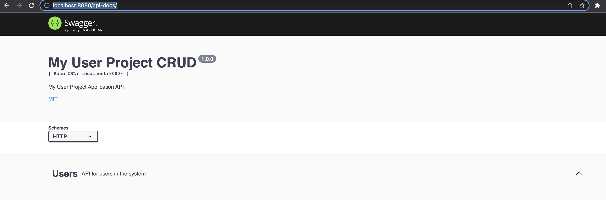

# **EasyLib Example and API Documentation**

Software Engineering, Tutorial

#### Antonio Bucchiarone - bucchiarone@fbk.eu

*Academic year 2022/2023 - First semester*


---

# Contents of today class

- EasyLib Application Example
- API documentation with Swagger

---
# EasyLib
> An app that students can use to lend books
> Models:
    - book
    - student
    - booklending

---

# app/Models/book.js

```javascript
var mongoose = require('mongoose');
var Schema = mongoose.Schema;

// set up a mongoose model
module.exports = mongoose.model('Book', new Schema({ 
	title: String
}));
```


---
# app/Models/student.js

```javascript
var mongoose = require('mongoose');
var Schema = mongoose.Schema;

// set up a mongoose model
module.exports = mongoose.model('Student', new Schema({ 
	email: String,
	password: String
}));
```

---
# app/Models/booklending.js

```javascript
var mongoose = require('mongoose');
var Schema = mongoose.Schema;

// set up a mongoose model
module.exports = mongoose.model('Booklending', new Schema({ 
	studentId: String,
	bookId: String
}));

```

---

# Book APIs
> find all books in the DB

```javascript
router.get('', async (req, res) => {
    let books = await Book.find({});
    books = books.map( (book) => {
        return {
            self: '/api/v1/books/' + book.id,
            title: book.title
        };
    });
    res.status(200).json(books);
});
```

---

# Book APIs
> find a book by its ID

```javascript
router.get('/:id', async (req, res) => {
    let book = await Book.findById(req.params.id);
    res.status(200).json({
        self: '/api/v1/books/' + book.id,
        title: book.title
    });
});
```

---

# Book APIs
> delete a book with a certain ID

```javascript
router.delete('/:id', async (req, res) => {
    let book = await Book.findById(req.params.id).exec();
    if (!book) {
        res.status(404).send()
        console.log('book not found')
        return;
    }
    await book.deleteOne()
    console.log('book removed')
    res.status(204).send()
});
```

---

# Book APIs
> Add a new Book

```javascript
router.post('', async (req, res) => {

	let book = new Book({
        title: req.body.title
    });
    
	book = await book.save();
    
    let bookId = book.id;

    console.log('Book saved successfully');
    res.location("/api/v1/books/" + bookId).status(201).send();
});
```

---

# Student APIs
> get a student via her/his email

```javascript
router.get('', async (req, res) => {
    let students;
    if (req.query.email)
        students = await Student.find({email: req.query.email}).exec();
    else
        students = await Student.find().exec();

    students = students.map( (entry) => {
        return {
            self: '/api/v1/students/' + entry.id,
            email: entry.email
        }
    });

    res.status(200).json(students);
});
```

---
# Student APIs
> add a new student

```javascript
router.post('', async (req, res) => {
    
	let student = new Student({
        email: req.body.email,
        password: req.body.password
    });

    if (!student.email || typeof student.email != 'string' || !checkIfEmailInString(student.email)) {
        res.status(400).json({ error: 'The field "email" must be a non-empty string, in email format' });
        return;
    }
    
	student = await student.save();
    let studentId = student.id;
    res.location("/api/v1/students/" + studentId).status(201).send();
});

```

--- 
# Check Email format function

```javascript
// https://stackoverflow.com/questions/46155/how-to-validate-an-email-address-in-javascript
function checkIfEmailInString(text) {
    // eslint-disable-next-line
    var re = /^(([^<>()[\]\\.,;:\s@\"]+(\.[^<>()[\]\\.,;:\s@\"]+)*)|(\".+\"))@((\[[0-9]{1,3}\.[0-9]{1,3}\.[0-9]{1,3}\.[0-9]{1,3}\])|(([a-zA-Z\-0-9]+\.)+[a-zA-Z]{2,}))$/;
    return re.test(text);
}
```
---

> Books assigned at a specific Student

```javascript
router.get('', async (req, res) => {
    let booklendings;
    if ( req.query.studentId )
        booklendings = await Booklending.find({
            studentId: req.query.studentId
        }).exec();
    else
        booklendings = await Booklending.find({}).exec();
    booklendings = booklendings.map( (dbEntry) => {
        return {
            self: '/api/v1/booklendings/' + dbEntry.id,
            student: '/api/v1/students/' + dbEntry.studentId,
            book: '/api/v1/books/' + dbEntry.bookId
        };
    });
    res.status(200).json(booklendings);
});

```

---

> New book for a student

```javascript
router.post('', async (req, res) => {
    let studentUrl = req.body.student;
    let bookUrl = req.body.book;

    if (!studentUrl){
        res.status(400).json({ error: 'Student not specified' });
        return;
    };
    
    if (!bookUrl) {
        res.status(400).json({ error: 'Book not specified' });
        return;
    };
    
    ...
```
---

> New book for a student - continue

```javascript
    let studentId = studentUrl.substring(studentUrl.lastIndexOf('/') + 1);
    let student = null;
    try {
        student = await Student.findById(studentId);
    } catch (error) {
        // This catch CastError when studentId cannot be casted to mongoose ObjectId
        // CastError: Cast to ObjectId failed for value "11" at path "_id" for model "Student"
    }

    if(student == null) {
        res.status(400).json({ error: 'Student does not exist' });
        return;
    };
    ...
```

---

> New book for a student - continue

```javascript
    let bookId = bookUrl.substring(bookUrl.lastIndexOf('/') + 1);
    let book = null;
    try {
        book = await Book.findById(bookId).exec();
    } catch (error) {
        // CastError: Cast to ObjectId failed for value "11" at path "_id" for model "Book"
    }
    
    if(book == null) {
        res.status(400).json({ error: 'Book does not exist' });
        return; 
    };
    ...

```

--- 

> New book for a student - continue

```javascript
if( ( await Booklending.find({bookId: bookId}).exec() ).lenght > 0) {
        res.status(409).json({ error: 'Book already out' });
        return
    }
    
	let booklending = new Booklending({
        studentId: studentId,
        bookId: bookId,
    });
    
	booklending = await booklending.save();
    
    let booklendingId = booklending.id;
    
    res.location("/api/v1/booklendings/" + booklendingId).status(201).send();

```


---

> Remove a lending

```javascript
router.delete('/:id', async (req, res) => {
    let lending = await Booklending.findById(req.params.id).exec();
    if (!lending) {
        res.status(404).send()
        console.log('lending not found')
        return;
    }
    await lending.deleteOne()
    console.log('lending removed')
    res.status(204).send()
});

```
--- 

# Testing with postman


--- 

# Testing with postman


---

# Documenting a Node.js REST API using Swagger

- https://swagger.io/

```javascript
npm i swagger-ui-express
```
- Swagger is a software tool used for designing, building, documenting, and using RESTful APIs. It follows the OpenAPI specification.


---

# Introduction
- Swagger relies on specifications in developing the documentation of an API. The specifications can be in **YAML** or **JSON** format.

- **YAML** (YAML Ain’t Markup Language) is a data serialization standard for writing configuration files.

- **JSON** (JavaScript Object Notation) is a lightweight data-serialization standard that follows the JavaScript object syntax. Data is arranged in key/value pair.

- We will implement the specifications using the JSON format. With this format we will document from .js files.

---

# Documenting API general information
- API’s general information comprises the openAPI version openapi and the API’s specific information under the **info** object.

- The **info object** comprises a **title**, **description** , **version**, **contact** information, etc.

- The information is highly recommended for publicly available APIs to enhance the developer’s experience.

- In our APIs, we will document the general information in the **docs/basicInfo.js** file.

---
# Swagger Usage


---

- Create a new file **swagger.json** at the root

```javascript
{
  "swagger": "2.0",
  "info": {
    "version": "1.0.0", //version of the OpenAPI Specification
    "title": "My User Project CRUD",
    "description": "My User Project Application API",
    "license": {
      "name": "MIT",
      "url": "https://opensource.org/licenses/MIT"
    }
  },
  "host": "localhost:8000",
  "basePath": "/",
  "tags": [
    {
      "name": "Users",
      "description": "API for users in the system"
    }
  ],
  "schemes": ["http"],
  "consumes": ["application/json"],
  "produces": ["application/json"]
}
```
---

> Open the **app.js** file and add the below code for swagger integration

```javascript
const swaggerUi = require(‘swagger-ui-express’),
swaggerDocument = require(‘../swagger.json’);


app.use(
    '/api-docs',
    swaggerUi.serve,
    swaggerUi.setup(swaggerDocument)
);
```
---
- Now Open the browser with http://localhost:8080/api-docs/

- You will able to see the swagger UI for documentation.



---

- Now we need to create **documentation** for our existing APIs. 

- As we know we have four API's CRUD(Create (POST), Read (GET), update (PUT), and delete (Delete).


---

> GET
- Open the **swagger.json** file and add the below code for documentation of API

```javascript
 "paths": {
        "/api/v1/books": {
            "get": {
                "tags": [
                    "Books"
                ],
                "summary": "Get all books in system",
                "responses": {
                    "200": {
                        "description": "OK",
                        "schema": {
                            "$ref": "#/definitions/Books"
                        }
                    }
                }
            }
        }
    },
```
---

# Definition

```javascript

"definitions": {
        "Books": {
            "required": [
                "title"
            ],
            "properties": {
                "title": {
                    "type": "string"
                }
            }
        }
    }
```

---


---

# Questions?

bucchiarone@fbk.eu